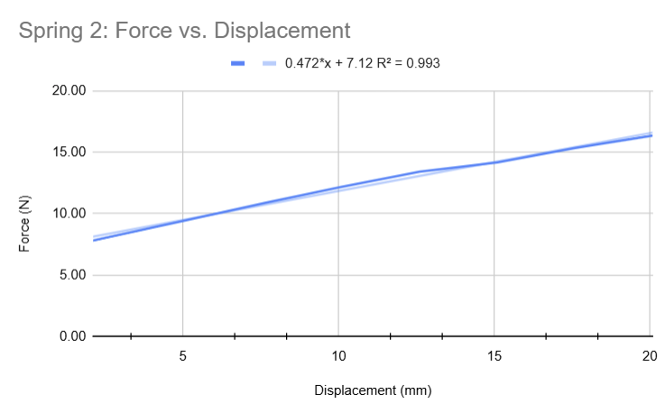
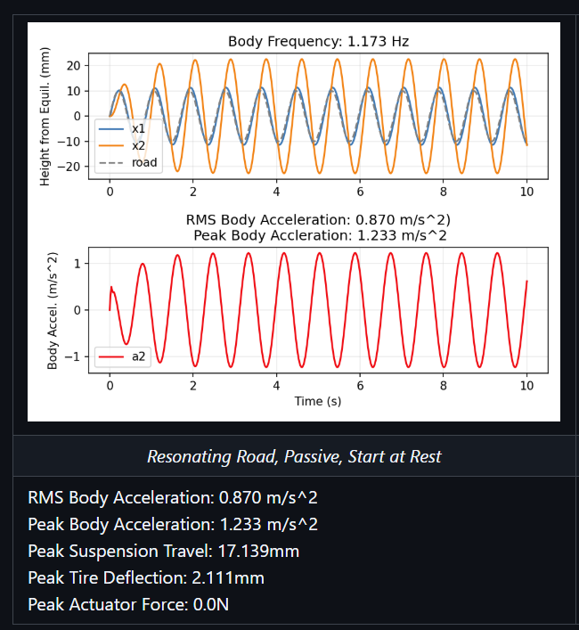
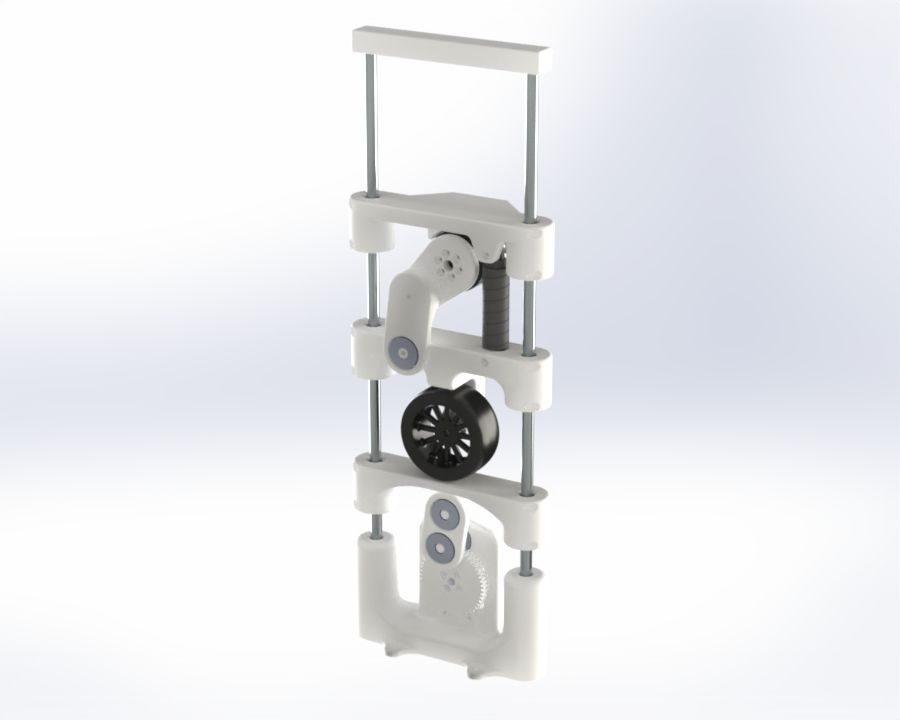
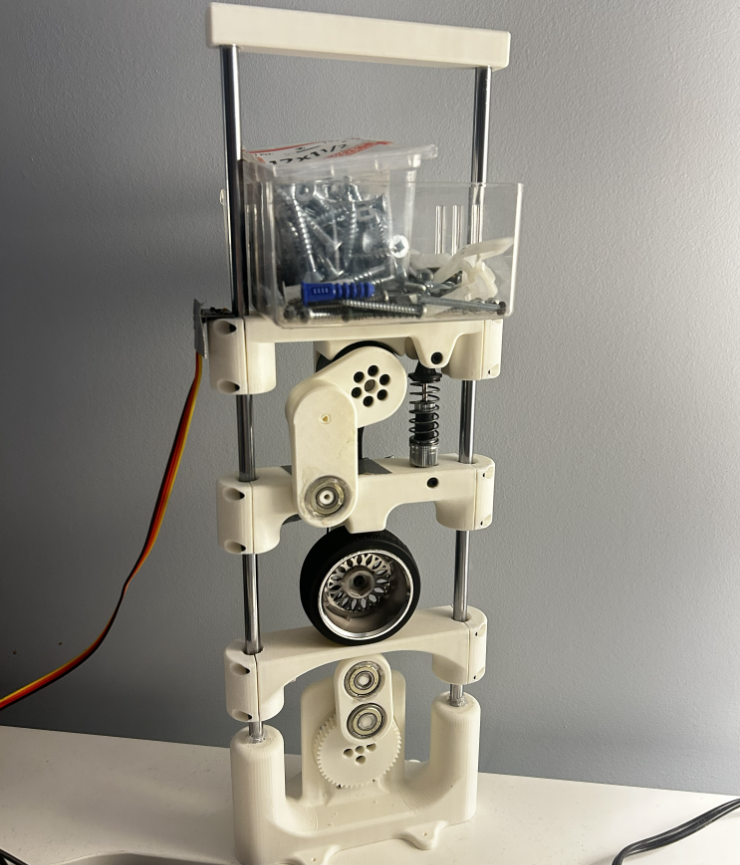
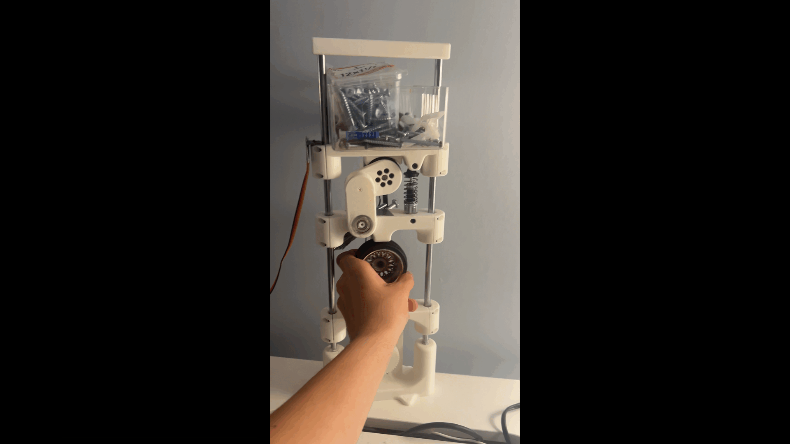

# Phase 2 Write-Up

After the simulations from <a href="phase1_writeup.md">phase 1</a>, phase 2 was meant to implement the derived physics and skyhook controller into a physical rig.

These were the steps I was going to take to complete phase 2:

1. Build out a BOM based off of preliminary calculations
2. Test the BOM parts upon arrival
3. Make the CAD for the rig
4. Implement the math from phase 1 into the controls for the actual rig
5. Test the rig on various roads
6. Compile the data and compare sim against real-world results

## 1. The BOM

Before jumping into the BOM, I needed to know what I was building for and how I could represent all parts of phase 1. I already knew that I wanted the system to be constrained to move only vertically, so I knew I would need linear bearings and rails. The other obvious parts that came to mind were:

- A wheel
- Spring(s)
- Damper
- Actuator (for skyhook)
- Some mass for $m_2$
- IMU to read body acceleration and get our data
- PSU

The largest piece that was missing was the road; I needed a way to make a road move. I eventually decided on having a motor, crank, and pushrod, that way we could easily translate the rotation motion of the motor into linear movement. I also decided to do the same for the skyhook actuator.

With all this in mind, what I imagined was a system living on linear rails, a motor attached to a road through crank and pushrod, wheel attached to a carriage, carriage connected to the body via spring, damper, and actuator, and a payload on the body.

### Linear Rails, Linear Bearings, Wheel, Spring, and Damper
I ordered standard linear rails and linear bearings off of Amazon, as well as a generic RC buggy car wheel with a passive suspension that came with a spring and damper already attached.

### Actuator
I knew the actuator would need to be strong, fully back-driveable, and have torque control. The back-drivability constraint narrowed down the search to direct drive or quasi-direct drive actuators, as those are the only two motor types that are back-driveable. Due to the high market demand of QDD actuators, I decided to go with the cheaper option of a DD motor.

Searching for a high torque DD with torque control at a low cost was a challenge, but I eventually landed on <a href="https://aifitlab.com/products/damiao-dm-h6215-servo-motor">Damiao's DM-H6215</a>. It had the torque control I needed, nominal torque of 1Nm, and stall torque of 2Nm. I was also lucky enough to get it for only $59, which was quite low compared to competitors.

### $m_2$, IMU, and PSU

For $m_2$ I was going to just use a bin and fill it with old pieces of metal I had lying around the house until my scale read whatever value I needed.

For the IMU, I ordered an <a href="https://www.amazon.ca/Pre-Soldered-Accelerometer-Raspberry-Compatible-Arduino/dp/B0BMY15TC4/">MPU6050</a> off of Amazon.

I had some spare 12V and 24V PSUs lying around my house from old electronics and would use those.

### Road Motor

For the road motor, I knew that I just needed a cheap, high speed, high torque motor. The only motors that are cheap with high torque and high speed are servos. I went with the <a href="https://ca.robotshop.com/products/hiwonder-hiwonder-hx-35h-serial-bus-high-voltage-servo-w-double-shaft-35kg-torque-data-feedback?qd=b09aaf28c4f53fdcc316d2556db7f41a">HX 35H</a> servo, for the 3.4Nm stall torque and 56RPM. The 56RPM was a concern, as it translates to 0.933Hz at nominal load. In order to get to the desired range I had in mind of 0-4Hz, I would need to gear up the motor 5:1, but the high torque would allow this trade-off.

In order to confirm the motor would be ok, I assumed a mass of 2kg for wheel and body as an upper limit, as well as a road amplitude of 10mm. From there we can find the torque of the motor as $2kg \times 9.81m/s^2 \times 0.01m \times 10 = 1.96Nm$. This is close to the 2.45Nm nominal torque, but should be ok for long usage since we are still under nominal.

### Other Parts
I had spare heat inserts, ball bearings, and screws lying around the house, and just designed the CAD around what I had.

## 2. Part Testing

Once all the parts arrived, there was a lot of testing I needed to conduct. I needed to find all of my locked parameters, such as $k_1, k_2$, and $b$.

Due to my lack of high precision measuring equipment, the only thing I was able to measure was $k_2$. The wheel was impossible to hold still and get measurements, as the deflection was so small that my caliper was not able to read the small deflections. The damping coefficient was also not possible to measure, as the spring and damper were assembled together in the factory and I could not separate them.

### How I Measured $k_2$

This was an absolute pain to measure, but what I did was place the spring on a scale, measure the distance from the table, and log the reading on the scale. I repeated this five times for each measurement, moving by 2.5mm until the suspension bottomed out. Here was the result:

    
    
<i>Force vs. displacement graph for spring 2</i>

From the graph we find that there is a preload force of 7.12N, $k_2$=0.472N/mm, total suspension travel was 19.6mm, and our data had an $R^2=0.993$.

## 3. CAD

A couple things needed to be taken into account before beginning the CAD:

1. DM-H6215 moment arm
2. HX 35H moment arm

Everything else (body frequency, wheel hop, etc…) could be figured out by taking actual measurements of the full rig instead of the dodgy measurements I would need to take for tire/suspension deflection and force measurements. 

### HX 35H Moment Arm

Looking at our previous calcs from phase 1, this test is the most prominent of them all in terms of suspension travel:

    

Note that the peak suspension travel lands at 17mm on a road that oscillates $\pm10mm$. Looking closer at the graph shows us that since suspension travel is measured from equilibrium, during the worst road conditions (resonance), the suspension will travel nearly double the road height.

When we look at our model, if we choose 8mm of total travel ($\pm4mm$), we can deduce that the peak suspension travel will max out at 8mm. Since this is 8mm from equilibrium, we knew that the bottom to top of the suspension travel will be 16mm, which is under our 19.6mm ceiling.

Therefore, the moment arm must be **4mm** to stay comfortably in the suspension range.

### DM-H6215 Moment Arm

We are using the DM-H6215, which has a stall torque of 2Nm.

$$
\tau=F\cdot r \Rightarrow r=\frac{\tau}{F}
$$

To find what our force needs to be, we need to look at peak actuator force.

$$
F_{peak}=\lvert c_{sky}\cdot\dot{x}_2 \rvert,\quad \dot{x}_2=A\omega \quad \text{(Derived in phase 1)}
$$

The amplitude will be 4mm, and the angular velocity will be: $\omega = 2 \pi f_n$. Assuming the absolute worst case of having the resonant frequency be as high as 5Hz, we can solve for the velocity:

$$
\omega = 10\pi \Rightarrow \dot{x}_2= 40\pi = 126mm/s
$$

The last missing piece is just $c_{sky}$. Since $c_{sky}$ depends on both spring stiffnesses, body mass, and the already existing damping coefficient of the suspension (as derived in phase 1), we must set an upper limit for these variables to calculate the peak force. Assuming $k_2=0.5N/mm,\ k_1=10N/mm,\ b=0,\ m_2=600g$, and $\zeta_{eff}=0.8$ (estimated values from before the BOM arrived), we get:

$$
\begin{aligned}
c_{sky} &= \zeta_{eff}\cdot c_c-b \cr
c_{sky} &= 0.8\cdot 2\cdot \sqrt{\frac{k_1k_2m_2}{k_1+k_2}} \cr
c_{sky} &= 1.6\cdot\sqrt{\frac{(10000)(500)(0.6)}{10000+500}}=27N\cdot s/m
\end{aligned}
$$

We can now solve for $F_{peak}$:

$$
F_{peak}=\lvert c_{sky}\cdot \dot{x}_2 \rvert=27 \times0.126=3.4N
$$

To find torque we can find the moment arm:

$$
\begin{aligned}
\tau_{peak} &= r\cdot F_{peak} \Rightarrow \tau_{peak}=3.4\cdot r \cr
r &= \frac{2Nm}{3.4N}=588mm
\end{aligned}
$$

This gives us the absolute upper bound of 588mm. We want to stay well under nominal, so plugging in the nominal torque of 1Nm and halving it gives us ~15cm. This is still ridiculously long, and considering torque will be noticeable at that large of a scale, it makes sense that we reduce the moment arm as much as possible to improve the cogging. To reduce cogging, we will choose a comfortable lever length of 50mm.

The thickness of the arm is also going to be quite wide to fit the bearing, but this actually helps us because it would reduce deflection of the cantilevered moment arm according to the following equation:

$$
\begin{aligned}
\delta_{max} &= \frac{PL^3}{3EI},\quad I=\frac{bh^3}{12} \Rightarrow \delta_{max}=\frac{4PL^3}{Ebh^3} \cr
\therefore \delta_{max} &\propto \frac{1}{h^3}
\end{aligned}
$$

I used SolidWorks to model everything. Here is the final render:

    

## The Turn

After completing the CAD, I 3D-printed all the parts, wired up the electronics, and put everything together. I started off by solving what $m_2$ should be.

Since the body should sit in the centre of the suspension, we can find the following:

$$
\begin{aligned}
F &= kx+F_{preload} \cr
m_2g &= k_2(19.6/2)+F_{preload} \cr
m_2 &= \frac{19.6k_2+2F_{preload}}{2g} \cr
m_2 &= 1.2kg
\end{aligned}
$$

This is what the entire system looks like once built out:

    

---

I then went to measure the suspension travel, and this is where things took a turn. I measured the sag after releasing the body from the top of the suspension vs. at the bottom, and got a band of error from 1.5mm-2mm. This was concerning, as that meant there was a lot of friction in the system. I know this because as soon as I removed the actuator, the band closed to around 5mm. The reason the actuator made such a big difference was because the motor itself has a cogging torque (amount of torque to move the rotor), and that torque is extended along the 50mm moment arm, multiplying the forces throughout the system.

The big problem here is that these forces ended up overdamping the system, and skyhook cannot run if the system is overdamped; see phase 1 for the reasoning as to why. When I tried a drop test, hold and release, and a 3Hz road, the system showed perfect symptoms of an overdamped system.

Unfortunately, due to the small scale of the rig, the friction and cogging forces ended up on the same order as the suspension forces. Due to this, the system was overdamped and skyhook could not be implemented.

Here are the videos I have of the rig. Notice how the system moves. Actuator is off for all videos.

| <i>3Hz road moved via Hiwonder bus servo terminal software</i> | <i>Drop test</i> | <i>Push down and pull up</i> |
| --- | --- | --- |
|  |  |  |

## Conclusion
Due to the small nature of the rig, unfortunately it was impossible to see skyhook controls in action; the forces caused overdamping, resulting in skyhook being impossible to implement.

To fix this, the rig would need to be considerably bigger so the small frictional and cogging forces are no longer on the same order as the suspension forces. Alternatively, I could spend more money upgrading the actuator to have a lower cogging torque and buy smoother linear and ball bearings.

I ended up learning a lot from phase 2 despite not being able to implement the controller and seeing skyhook in action. It was fun seeing the full model actually be in my hands after all the calculations in phase 1. I learnt a lot about where I needed to make assumptions and how to design around imperfect hardware for the future.

Although the outcome was not what I intended, I still wanted to share my engineering process. Even if I did not achieve my original goal, I persevered through a lot of work, and I am happy with what I was able to achieve.
